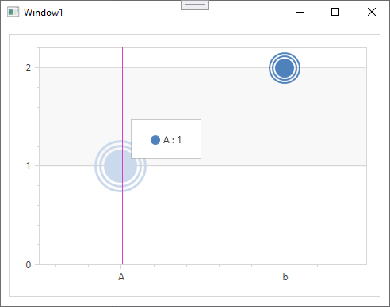

<!-- default badges list -->

<!-- default badges end -->

# Chart for WPF -  How to Create Custom Series Point Markers

This example illustrates the capability to create a custom marker.

Follow the steps below to create a custom marker model:

* Assign a [CustomMarker2DModel](https://docs.devexpress.com/WPF/DevExpress.Xpf.Charts.CustomMarker2DModel) object to the `MarkerModel` property.
* Create a [ControlTemplate](https://learn.microsoft.com/en-us/dotnet/desktop/wpf/controls/how-to-create-apply-template?view=netdesktop-7.0) with visual elements.
* Assign this template to the [CustomMarker2DModel.PointTemplate](https://docs.devexpress.com/WPF/DevExpress.Xpf.Charts.CustomMarker2DModel.PointTemplate) property.

## Files to Review 

* [Window1.xaml](./CS/WpfApplication1/Window1.xaml) (VB: [Window1.xaml](./VB/WpfApplication1/Window1.xaml))

## Documentation

* [Series Points](https://docs.devexpress.com/WPF/6340/controls-and-libraries/charts-suite/chart-control/series/series-points)
* [Series and Marker Models](https://docs.devexpress.com/WPF/4285/controls-and-libraries/charts-suite/chart-control/series/series-and-marker-models)

## More Examples 

* [Chart for WPF - How to Select a Series Point Marker Based on a Point Argument](https://github.com/DevExpress-Examples/select-a-series-point-marker-based-on-a-point-argument)
